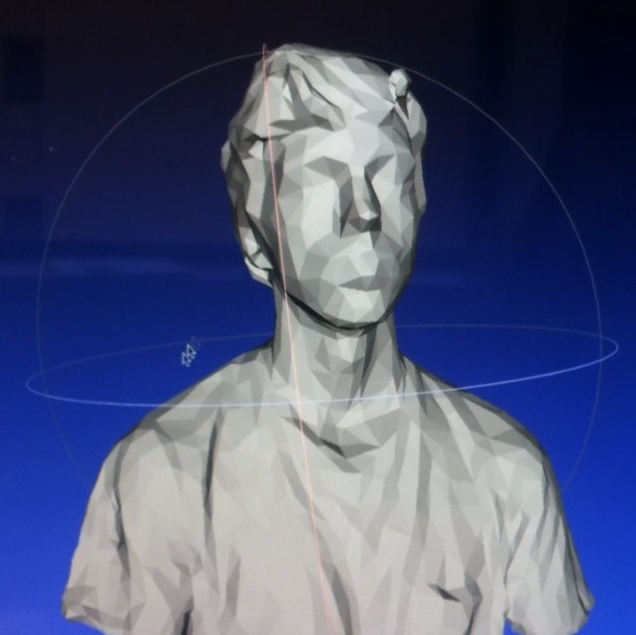


 

I am a PhD student in [Neural Computation](http://www.cnbc.cmu.edu/pnc) at Carnegie Mellon University, where I use techniques from statistics and machine learning to study the relationship between neural populations and behavior. My advisors are [Byron Yu](https://users.ece.cmu.edu/~byronyu/) and [Steve Chase](http://www.cnbc.cmu.edu/~schase/index.php).

You can find my CV [here](/assets/pdf/JayHennig-CV.pdf), or send me an email at .

When I'm not working in the lab, I'm probably coding, reading, or watching something:

<a href="https://github.com/{{ site.author.github }}" class="button green">Code</a>

<a href="/medialog" class="button green">Medialog</a>

<a href="/blog" class="button green">Blog</a>

